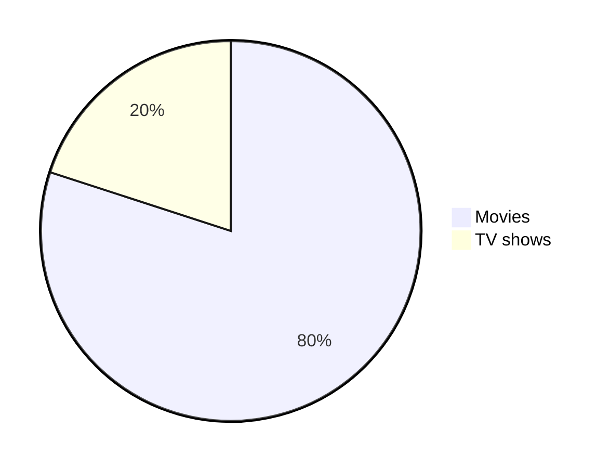
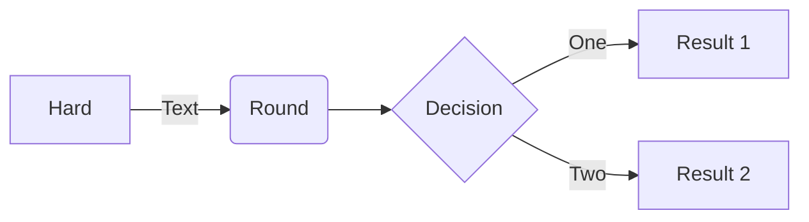
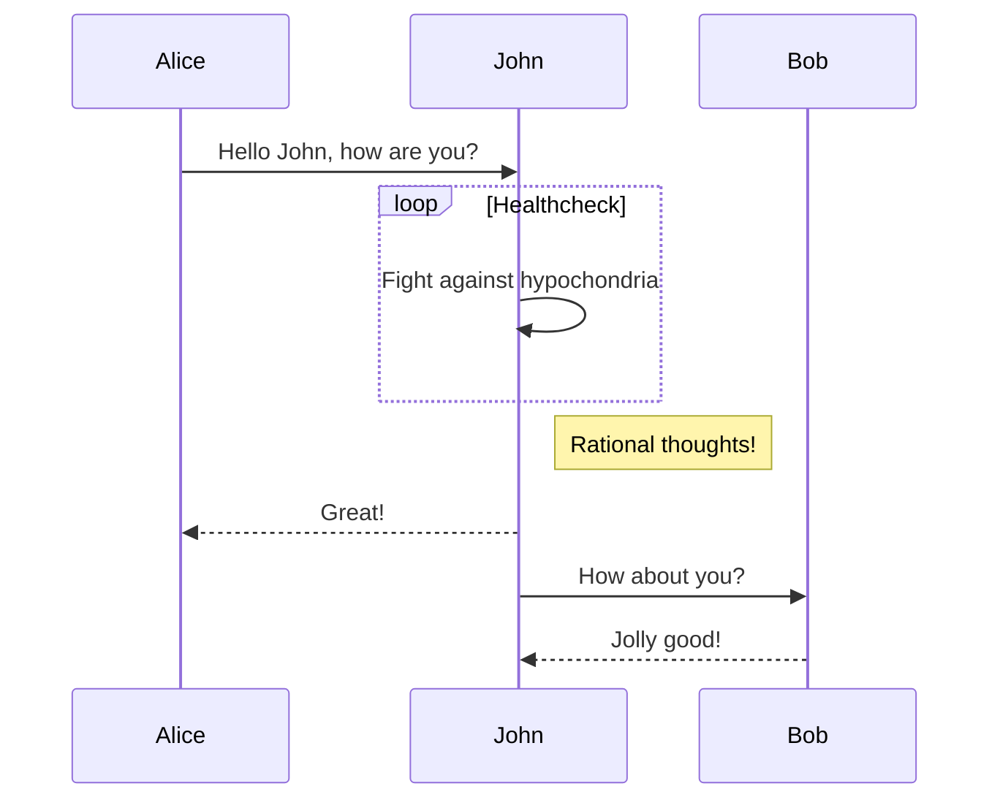

# Learn K8S

### Application
Github Repo for learning K8S.
* [Frontend](https://github.com/vimalmenon/k8s-frontend)
* [Backend](https://github.com/vimalmenon/k8s-backend)
---
### Pre Requisites
* Need to have basic understanding of docker, container and images
* Need to have docker installed
---
### Topics
* [K8S Architecture](https://github.com/vimalmenon/k8s-learn/tree/master/example/K8S%20Architecture)
* [Minikube](https://github.com/vimalmenon/k8s-learn/tree/master/example/Minikube)
* [Kubectl](https://github.com/vimalmenon/k8s-learn/tree/master/example/Kubectl)
* [Pods](https://github.com/vimalmenon/k8s-learn/tree/master/example/Pods)
* [ReplicaSet](https://github.com/vimalmenon/k8s-learn/tree/master/example/ReplicaSet)
* [Deployment](https://github.com/vimalmenon/k8s-learn/tree/master/example/Deployment)
* [DaemonSet](https://github.com/vimalmenon/k8s-learn/tree/master/example/DaemonSet)
* [Namespace](https://github.com/vimalmenon/k8s-learn/tree/master/example/Namespace)
* [Job](https://github.com/vimalmenon/k8s-learn/tree/master/example/Job)
* [CronJob](https://github.com/vimalmenon/k8s-learn/tree/master/example/CronJob)
* [Probe](https://github.com/vimalmenon/k8s-learn/tree/master/example/Probe)
* Data
    - [ConfigMap](https://github.com/vimalmenon/k8s-learn/tree/master/example/ConfigMap)
    - [Secret](https://github.com/vimalmenon/k8s-learn/tree/master/example/Secret)
* [Resources](https://github.com/vimalmenon/k8s-learn/tree/master/example/Resources)
* Volume
    - [LocalStorage](https://github.com/vimalmenon/k8s-learn/tree/master/example/LocalStorage)
---
### Sample Project
* K8S
    * LimitRange
    * ResourceQuota
    * Probes
    * Scheduling
    * Volume
        - Local storage
            -  At pod level
            -  At Node level
        - Persistent volumes (Not Covered)
        - Persistent volumes claim (Not Covered)
        - Storage class (Not Covered)
    * Service
        - ClusterIp
        - NodePort
        - Loadbalancer (Not Covered)
        - Ingress
        - Ingress controller
        * Statefull
            - Headless
            - StatefullSet
    * Helm
    * Service Mesh
    * Deployment strategy
        - Blue Green deployment (Not Covered)
        - Canary Deployment (Not Covered)
    * More...
---
### Create a basic pods
Minikube start with 2 nodes with name local-cluster
```bash
minikube start -n 2 -p local-cluster
``` 
Minikube check status
```bash
minikube status -p local-cluster
```
Kubectl create pod 
```bash
kubectl create -f ./k8s/pods/01-Pods.yaml
```
Kubectl list pod with all details
```bash
kubectl get pods -o wide
```
Kubectl list pod with labels
```bash
kubectl get pods -l type=front-end
```
Kubectl port forward to localhost
```bash
kubectl port-forward front-end-app 3000:3000 
```
Kubectl check logs
```bash
kubectl logs front-end-app
```
Kubectl delete the pod
```bash
kubectl delete -f ./k8s/pods/01-Pods.yaml 
```
--- 
### Create a basic ReplicaSet
Kubectl create ReplicaSet 
```bash
kubectl apply -f ./k8s/replicaset/01-ReplicaSet.yaml
```
Kubectl check replicaset
```bash
kubectl get replicaset
```
Kubectl list pod
```bash
kubectl get pods
```
Kubectl delete the replicaset
```bash
kubectl delete -f ./k8s/replicaset/01-ReplicaSet.yaml
```
--- 
### Create a basic Deployment
Kubectl create Deployment 
```bash
kubectl apply -f ./k8s/deployment/01-Deployment.yaml
```
Kubectl check replicaset
```bash
kubectl get replicaset
```
Kubectl list pod
```bash
kubectl get pods
```
Kubectl delete the Deployment
```bash
kubectl delete -f ./k8s/deployment/01-Deployment.yaml
```
--- 
### Create a basic Service (ClusterIP)
Kubectl create Deployment 
```bash
kubectl apply -f ./k8s/services/01-ClusterIPService.yaml
```
Kubectl check service
```bash
kubectl get service
```
Kubectl delete the service
```bash
kubectl delete -f ./k8s/services/01-ClusterIPService.yaml
```
--- 
### Create a basic Service (NodePort)
Kubectl create Deployment 
```bash
kubectl apply -f ./k8s/services/02-NodePort.yaml
```
Kubectl check service
```bash
kubectl get service
```
Kubectl delete the service
```bash
kubectl delete -f ./k8s/services/02-NodePort.yaml
```
--- 
### ConfigMap / Secret
Kubectl apply configmap
```bash
kubectl apply -f ./k8s/configmap/01-ConfigMap.yaml
```
kubectl list all configmap
```bash
kubectl get configmap
```
kubectl display values of configmap
```bash
kubectl get configmap app-data -o yaml
```
Docker create build for version 0.0.1
```bash
docker build -t vimalsmenon/front-end-app:0.0.1 .
```
Docker push
```bash
docker push vimalsmenon/front-end-app:0.0.1
```
Kubectl start pods
```bash
kubectl create -f ./k8s/pods/02-Pods.yaml
```
Kubectl secret
```bash
kubectl apply -f ../../k8s/configmap/02-Secret.yaml
```
Kubectl create pod
```bash
kubectl apply -f ./k8s/pods/03-Pods.yaml
```
Config Path as Mount Volume
```bash
kubectl apply -f ./k8s/configmap/03-ConfigMap.yaml
```
```bash
kubectl apply -f ./k8s/pods/04-Pods.yaml
```
* Notes
    - Values of secret has to be base64 encoded
    - Mounted volume can also be optional

--- 
### Volume
Simple Volume as pod level
```bash
kubectl apply -f ./k8s/pods/05-Pods.yaml
```
Simple Volume as node level
```bash
kubectl apply -f ./k8s/pods/06-Pods.yaml
```
Simple Volume as node level
```bash
minikube ssh -p <profile-name>
```
--- 
### RBAC (Role Based Access Role)
Location for Kube config
```bash
vim ~/.kube/config
```
---
### Question
* Difference between replicaset and deployment
* Need to check on CustomResourceDefinition
* what is Service Mesh
* need to understand kubectl config
* what is rook
--- 
### Kubectl command
Kubectl list all resources
```bash
kubectl api-resources
```
Kubectl getting into pod
```bash
kubectl exec -it front-end-app bash
```
Kubectl list all
```bash
kubectl get all
```
Kubectl command to show labels (Works with all the command)
```bash
kubectl get all --show-labels
```
Kubectl watch for changes (Works with all the command)
```bash
kubectl get pods --watch
```
Kubectl check logs with stream
```bash
kubectl logs front-end-app -f
```
Kubectl get endpoints
```bash
kubectl get endpoints
```
Kubectl get namespaces
```bash
kubectl get namespaces
```
Kubectl create namespace
```bash
kubectl create namespace <name>
```
Kubectl delete namespace
```bash
kubectl delete namespace <name>
```
Kubectl create namespace
 ```bash
kubectl apply -f ./k8s/namespace/01-Namespace.yaml
```
Kubectl delete the service
```bash
kubectl apply -f ./k8s/services/02-NodePort.yaml
```
Kubectl explains the command
```bash
kubectl explain pods
```
Kubectl get CPU and Memory usage
```bash
kubectl top pods --all-namespaces
```
Kubectl get context
```bash
kubectl config get-contexts
```
Kubectl check logs for container within the pod
```bash
kubectl logs <pod> -c <container>
```
Kubectl get storage class
```bash
kubectl get storageclass
```
--- 
### Minikube command
Start minikube with cluster
```bash
minikube start -n <number of nodes> -p <cluster-name>
``` 
Status of the cluster
```bash
minikube status -p <cluster-name>
```
Open dashboard
```bash
minikube dashboard --url -p <cluster-name>
```
Add worker node
```bash
minikube node add --worker -p <cluster-name>
```
Delete worker node
```bash
minikube node delete <node-name> -p <cluster-name>
```
Delete all the cluster and profile
```bash
minikube delete --all
```
SSH to pod
```bash
minikube ssh -n local-cluster-m02 -p local-cluster
```
Start the service (NodePort)
```bash
minikube service front-end-app-service -p local-cluster
```
minkube add metrics-server
```bash
minikube addons enable metrics-server
```
minikube addons list
```bash
minikube addons list
```
minikube list profile
```bash
minikube profile list
```
---

---

---

