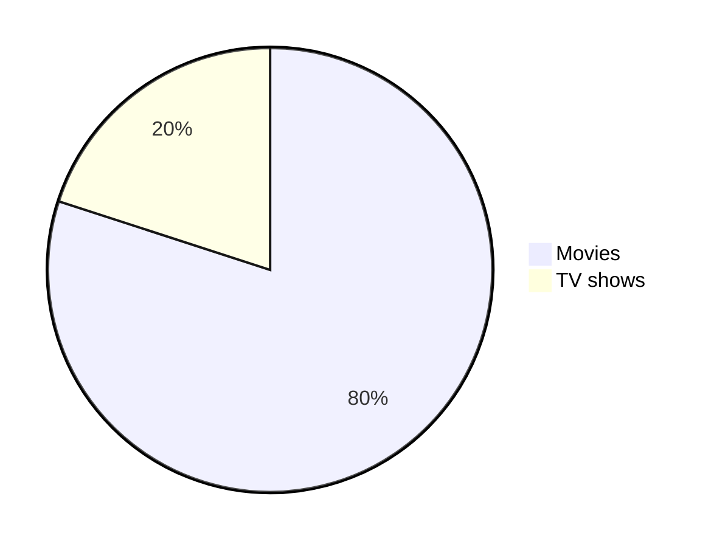
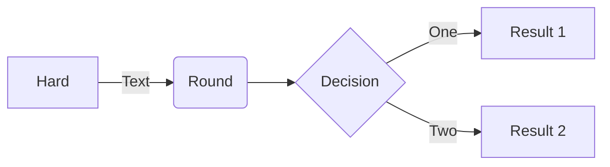
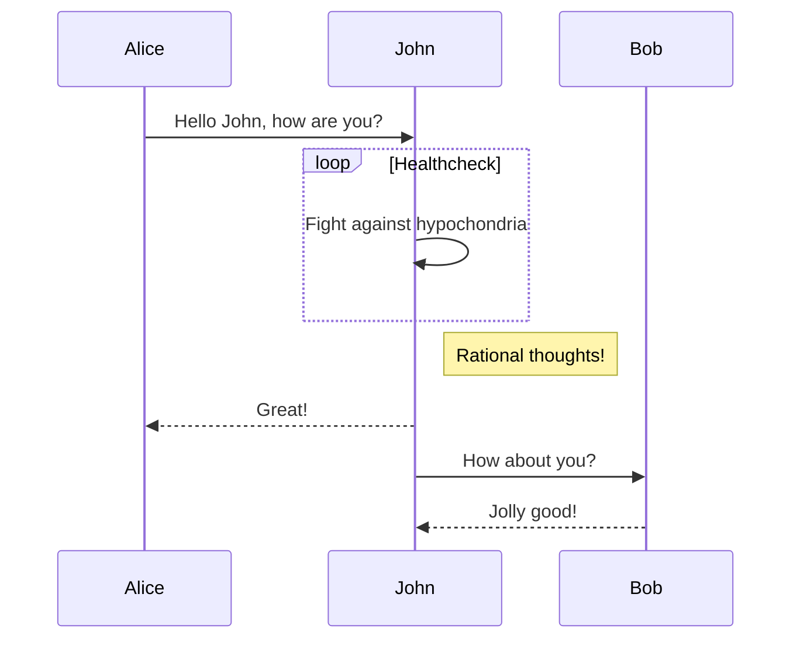

# Learn K8S

### Application Setup


### Sample Project
* App
    * FrontEnd App
    * BackEnd App
* Integration
    * Integrate FrontEnd with BackEnd
* K8S
    * Namespace
    * Pods
    * ReplicaSet
    * Deployment
        - Blue Green deployment (Not Covered)
        - Canary Deployment (Not Covered)
    * Service
        - ClusterIp
        - NodePort
        - Loadbalancer (Not Covered)
    * Volume
        - Local storage (Not Covered)
        - Persistent volumes (Not Covered)
        - Persistent volumes claim (Not Covered)
        - Storage class (Not Covered)
    * Resources
    * ConfigMap
    * Secret
    * CronJob
    * Job
    * Demonset
    * More...
---
### Setting up FrontEnd App
Navigate inside the FrontEnd folder
```bash
cd App/FrontEnd
```
Build an image with a tag
```bash
docker build -tag front-end-app:0.0.0 .
```
Create a tag before pushing (This is compulsory)
```bash
docker tag front-end-app:0.0.0 vimalsmenon/front-end-app:0.0.0
```
Docker Login with username and password
```bash
docker login
```
Docker push
```bash
docker push vimalsmenon/front-end-app:0.0.0
```
---
### Create a basic pods
Minikube start with 2 nodes with name local-cluster
```bash
minikube start -n 2 -p local-cluster
``` 
Minikube check status
```bash
minikube status -p local-cluster
```
Kubectl create pod 
```bash
kubectl create -f ./k8s/pods/01-Pods.yaml
```
Kubectl list pod with all details
```bash
kubectl get pods -o wide
```
Kubectl list pod with labels
```bash
kubectl get pods -l type=front-end
```
Kubectl port forward to localhost
```bash
kubectl port-forward front-end-app 3000:3000 
```
Kubectl check logs
```bash
kubectl logs front-end-app
```
Kubectl delete the pod
```bash
kubectl delete -f ./k8s/pods/01-Pods.yaml 
```
--- 
### Create a basic ReplicaSet
Kubectl create ReplicaSet 
```bash
kubectl apply -f ./k8s/replicaset/01-ReplicaSet.yaml
```
Kubectl check replicaset
```bash
kubectl get replicaset
```
Kubectl list pod
```bash
kubectl get pods
```
Kubectl delete the replicaset
```bash
kubectl delete -f ./k8s/replicaset/01-ReplicaSet.yaml
```
--- 
### Create a basic Deployment
Kubectl create Deployment 
```bash
kubectl apply -f ./k8s/deployment/01-Deployment.yaml
```
Kubectl check replicaset
```bash
kubectl get replicaset
```
Kubectl list pod
```bash
kubectl get pods
```
Kubectl delete the Deployment
```bash
kubectl delete -f ./k8s/deployment/01-Deployment.yaml
```
--- 
### Create a basic Service (ClusterIP)
Kubectl create Deployment 
```bash
kubectl apply -f ./k8s/services/01-ClusterIPService.yaml
```
Kubectl check service
```bash
kubectl get service
```
Kubectl delete the service
```bash
kubectl delete -f ./k8s/services/01-ClusterIPService.yaml
```
--- 
### Create a basic Service (NodePort)
Kubectl create Deployment 
```bash
kubectl apply -f ./k8s/services/02-NodePort.yaml
```
Kubectl check service
```bash
kubectl get service
```
Kubectl delete the service
```bash
kubectl delete -f ./k8s/services/02-NodePort.yaml
```

### ConfigMap
Kubectl apply configmap
```bash
kubectl apply -f ./k8s/configmap/01-ConfigMap.yaml
```
kubectl list all configmap
```bash
kubectl get configmap
```
kubectl display values of configmap
```bash
kubectl get configmap app-data -o yaml
```
Docker create build for version 0.0.1
```bash
docker build -t vimalsmenon/front-end-app:0.0.1
```
Docker push
```bash
docker push
```
Kubectl start pods
```bash
kubectl create -f ./k8s/pods/02-Pods.yaml
```


### RBAC (Role Based Access Role)
Location for Kube config
```bash
vim ~/.kube/config
```

### openssl
Openssl version with all detail (Can also be used without -a)
```bash
openssl version -a
```
Openssl shows all 
```bash
openssl version --help
```
Openssl help 
```bash
openssl help
```
Checking sha456 of a file 
```bash
sha256sum <filename>
```
Checking sha456 of a file using openssl
```bash
openssl sha256 <filename>
```
Putting sha456 of a file to <output-file-name>
```bash
openssl sha256 - hex -out <output-file-name> <filename>
```
Create symmetric key with byte <number>
```bash
openssl rand -hex <number>
```
Create symmetric key with byte <number> output to <output-file-name>
```bash
openssl rand -hex -out <output-file-name <number>
```
Generate asymmetric key with size (Size is optional)
```bash
openssl genrsa <size>
```
Generate asymmetric key put to <output-file-name>
```bash
openssl genrsa -out <output-file-name>
```
Check if the generated key with filename
```bash
openssl genrsa -in <output-file-name> -noout -text
```
Create public key of private key
```bash
openssl rsa -in <private-key> -pubout -out <public-key-file>
```
List all the command to encrypt the data
```bash
openssl list -commands
```
List all the digest algorithms
```bash
openssl list -digest-algorithms
```
List all the cipher algorithms
```bash
openssl list -cipher-algorithms
```


* 5 pillars of Cryptography
    - integrity
    - confidentiality
    - Authentication
    - Authorization
    - Non repudiation
--- 
### Question
* Difference between replicaset and deployment
* Need to understand how to pass env variable in container in deployment
* Need to check on CustomResourceDefinition
* what is Service Mesh
* need to understand openssl
* need to understand kubectl config
* what is rook
--- 
### Kubectl command
Kubectl list all resources
```bash
kubectl api-resources
```
Kubectl getting into pod
```bash
kubectl exec -it front-end-app bash
```
Kubectl list all
```bash
kubectl get all
```
Kubectl command to show labels (Works with all the command)
```bash
kubectl get all --show-labels
```
Kubectl watch for changes (Works with all the command)
```bash
kubectl get pods --watch
```
Kubectl check logs with stream
```bash
kubectl logs front-end-app -f
```
Kubectl get endpoints
```bash
kubectl get endpoints
```
Kubectl get namespaces
```bash
kubectl get namespaces
```
Kubectl create namespace
```bash
kubectl create namespace <name>
```
Kubectl delete namespace
```bash
kubectl delete namespace <name>
```
Kubectl create namespace
 ```bash
kubectl apply -f ./k8s/namespace/01-Namespace.yaml
```
Kubectl delete the service
```bash
kubectl apply -f ./k8s/services/02-NodePort.yaml
```
Kubectl explains the command
```bash
kubectl explain pods
```
Kubectl get CPU and Memory usage
```bash
kubectl top pods --all-namespaces
```
Kubectl get context
```bash
kubectl config get-contexts
```
Kubectl check logs for container within the pod
```bash
kubectl logs <pod> -c <container>
```
Kubectl get storage class
```bash
kubectl get storageclass
```
--- 
### Minikube command
Start minikube with cluster
```bash
minikube start -n <number of nodes> -p <cluster-name>
``` 
Status of the cluster
```bash
minikube status -p <cluster-name>
```
Open dashboard
```bash
minikube dashboard --url -p <cluster-name>
```
Add worker node
```bash
minikube node add --worker -p <cluster-name>
```
Delete worker node
```bash
minikube node delete <node-name> -p <cluster-name>
```
Delete all the cluster and profile
```bash
minikube delete --all
```
SSH to pod
```bash
minikube ssh -n local-cluster-m02 -p local-cluster
```
Start the service (NodePort)
```bash
minikube service front-end-app-service -p local-cluster
```
minkube add metrics-server
```bash
minikube addons enable metrics-server
```
minikube addons list
```bash
minikube addons list
```
minikube list profile
```bash
minikube profile list
```
---

---

---
