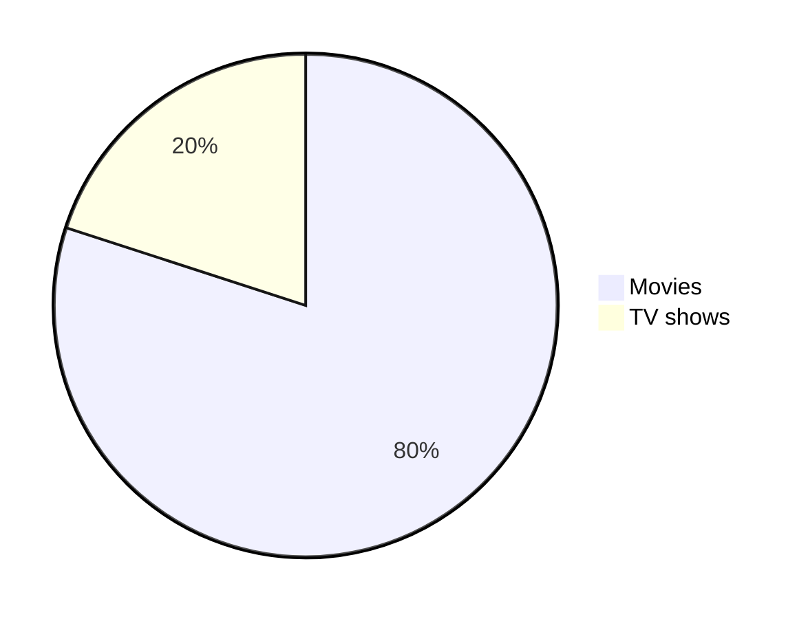
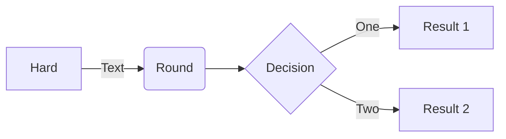
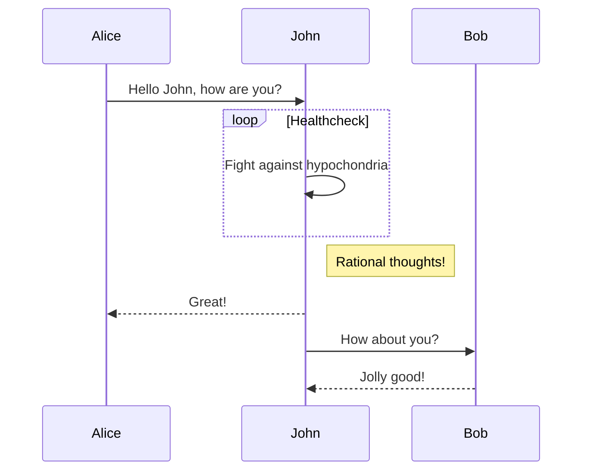

# Learn K8S

### Sample Project
* App
    * FrontEnd App
    * BackEnd App
* Integration
    * Integrate FrontEnd with BackEnd
* K8S
    * Deployment
    * Loadbalancer
    * Volume
    * ConfigMap
    * Secret
    * More...
---
### Setting up FrontEnd App
Navigate inside the FrontEnd folder
```bash
cd App/FrontEnd
```
Build an image with a tag
```docker
docker build -tag front-end-app:0.0.0 .
```
Create a tag before pushing (This is compulsory)
```bash
docker tag front-end-app:0.0.0 vimalsmenon/front-end-app:0.0.0
```
Docker Login with username and password
```bash
docker login
```
Docker push
```bash
docker push vimalsmenon/front-end-app:0.0.0
```
---
### Creating the basic pods
Minikube start with 2 node with name local-cluster
```bash
minikube start -n 2 -p local-cluster
``` 
Minikube check status
```bash
minikube status -p local-cluster
```
--- 
### Kubectl command
Kubectl list all resources
```bash
kubectl api-resources
```
--- 
### Minikube command
Start minikube with cluster
```bash
minikube start -n <number of nodes> -p <cluster-name>
``` 
Status of the cluster
```
minikube status -p <cluster-name>
```
Open dashboard
```
minikube dashboard --url -p <cluster-name>
```
Add worker node
```
minikube node add --worker -p <cluster-name>
```
Delete worker node
```
minikube node delete <node-name> -p <cluster-name>
```
Delete all the cluster
```
minikube delete --all
```
---

---

---
