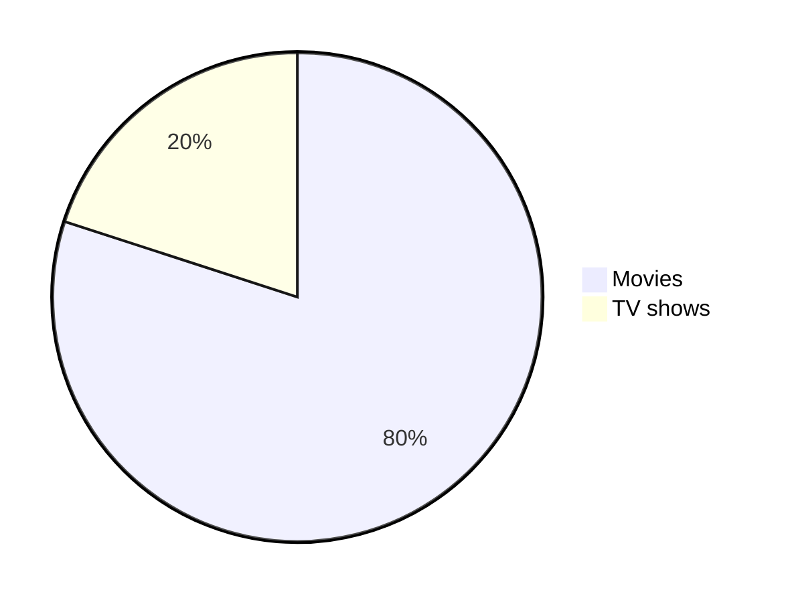
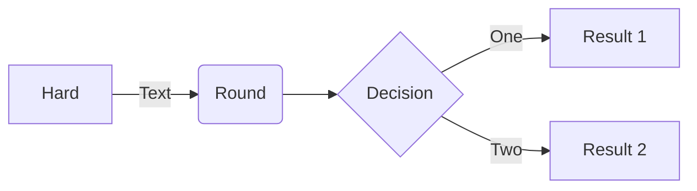

# Learning K8S

### Kubectl Sample Project
* App
    * FrontEnd App
    * BackEnd App
* Integration
    * Connecting FrontEnd with BackEnd
* K8S
    * Deployment
    * Loadbalancer
    * Volume
    * More...

---
### Kubectl command
Kubectl list all resources
```
kubectl api-resources
```
--- 
### Minikube command
Start minikube with cluster
```
minikube start -n <number of nodes> -p <cluster-name>
``` 
Status of the cluster
```
minikube status -p <cluster-name>
```
Open dashboard
```
minikube dashboard --url -p <cluster-name>
```
Add worker node
```
minikube node add --worker -p <cluster-name>
```
Delete worker node
```
minikube node delete <node-name> -p <cluster-name>
```
Delete all the cluster
```
minikube delete --all
```
---

---
