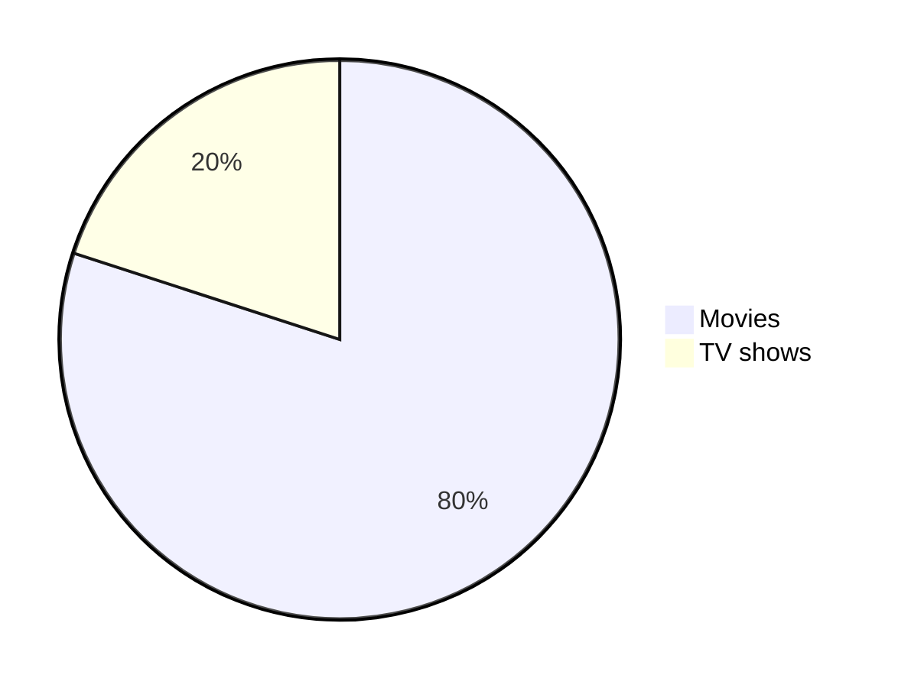
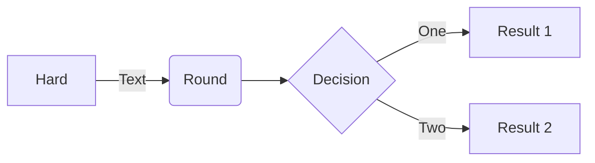
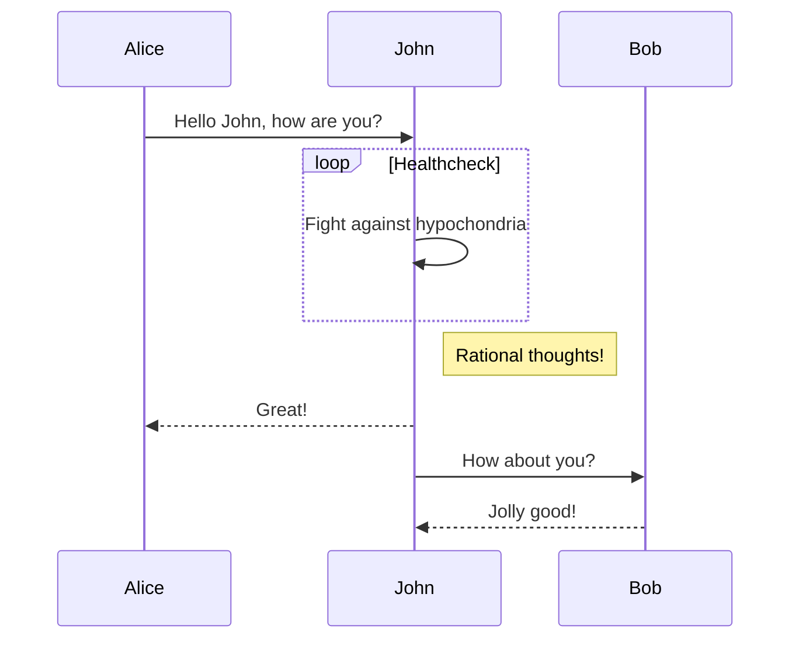

# Learn K8S

### Application Setup


### Sample Project
* App
    * FrontEnd App
    * BackEnd App
* Integration
    * Integrate FrontEnd with BackEnd
* K8S
    * Namespace
    * Pods
    * ReplicaSet
    * Deployment
        - Blue Green deployment
        - Canary Deployment
    * Service
        - ClusterIp
        - NodePort
        - Loadbalancer
    * Namespace
    * Volume
    * ConfigMap
    * Secret
    * CronJob
    * Job
    * Demonset
    * More...
---
### Setting up FrontEnd App
Navigate inside the FrontEnd folder
```bash
cd App/FrontEnd
```
Build an image with a tag
```bash
docker build -tag front-end-app:0.0.0 .
```
Create a tag before pushing (This is compulsory)
```bash
docker tag front-end-app:0.0.0 vimalsmenon/front-end-app:0.0.0
```
Docker Login with username and password
```bash
docker login
```
Docker push
```bash
docker push vimalsmenon/front-end-app:0.0.0
```
---
### Create a basic pods
Minikube start with 2 nodes with name local-cluster
```bash
minikube start -n 2 -p local-cluster
``` 
Minikube check status
```bash
minikube status -p local-cluster
```
Kubectl create pod 
```bash
kubectl create -f ./k8s/pods/01-Pods.yaml
```
Kubectl list pod with all details
```bash
kubectl get pods -o wide
```
Kubectl list pod with labels
```bash
kubectl get pods -l type=front-end
```
Kubectl port forward to localhost
```bash
kubectl port-forward front-end-app 3000:3000 
```
Kubectl check logs
```bash
kubectl logs front-end-app
```
Kubectl delete the pod
```bash
kubectl delete -f ./k8s/pods/01-Pods.yaml 
```
--- 
### Create a basic ReplicaSet
Kubectl create ReplicaSet 
```bash
kubectl apply -f ./k8s/replicaset/01-ReplicaSet.yaml
```
Kubectl check replicaset
```bash
kubectl get replicaset
```
Kubectl list pod
```bash
kubectl get pods
```
Kubectl delete the replicaset
```bash
kubectl delete -f ./k8s/replicaset/01-ReplicaSet.yaml
```
--- 
### Create a basic Deployment
Kubectl create Deployment 
```bash
kubectl apply -f ./k8s/deployment/01-Deployment.yaml
```
Kubectl check replicaset
```bash
kubectl get replicaset
```
Kubectl list pod
```bash
kubectl get pods
```
Kubectl delete the Deployment
```bash
kubectl delete -f ./k8s/deployment/01-Deployment.yaml
```
--- 
### Create a basic Service (ClusterIP)
Kubectl create Deployment 
```bash
kubectl apply -f ./k8s/services/01-ClusterIPService.yaml
```
Kubectl check service
```bash
kubectl get service
```
Kubectl delete the service
```bash
kubectl delete -f ./k8s/services/01-ClusterIPService.yaml
```
--- 
### Create a basic Service (NodePort)
Kubectl create Deployment 
```bash
kubectl apply -f ./k8s/services/02-NodePort.yaml
```
Kubectl check service
```bash
kubectl get service
```
Kubectl delete the service
```bash
kubectl delete -f ./k8s/services/02-NodePort.yaml
```
--- 
### Question
* Difference between replicaset and deployment
--- 
### Kubectl command
Kubectl list all resources
```bash
kubectl api-resources
```
Kubectl getting into pod
```bash
kubectl exec -it front-end-app bash
```
Kubectl list all
```bash
kubectl get all
```
Kubectl command to show labels (Works with all the command)
```bash
kubectl get all --show-labels
```
Kubectl check logs with stream
```bash
kubectl logs front-end-app -f
```
Kubectl get endpoints
```bash
kubectl get endpoints
```
Kubectl get namespaces
```bash
kubectl get namespaces
```
Kubectl create namespace
```bash
kubectl create namespace <name>
```
Kubectl delete namespace
```bash
kubectl delete namespace <name>
```
Kubectl create namespace
 ```bash
kubectl apply -f ./k8s/namespace/01-Namespace.yaml
```
Kubectl delete the service
```bash
kubectl apply -f ./k8s/services/02-NodePort.yaml
```
--- 
### Minikube command
Start minikube with cluster
```bash
minikube start -n <number of nodes> -p <cluster-name>
``` 
Status of the cluster
```bash
minikube status -p <cluster-name>
```
Open dashboard
```bash
minikube dashboard --url -p <cluster-name>
```
Add worker node
```bash
minikube node add --worker -p <cluster-name>
```
Delete worker node
```bash
minikube node delete <node-name> -p <cluster-name>
```
Delete all the cluster
```bash
minikube delete --all
```
SSH to pod
```bash
minikube ssh -n local-cluster-m02 -p local-cluster
```
Start the service (NodePort)
```bash
minikube service front-end-app-service -p local-cluster
```
---

---

---
